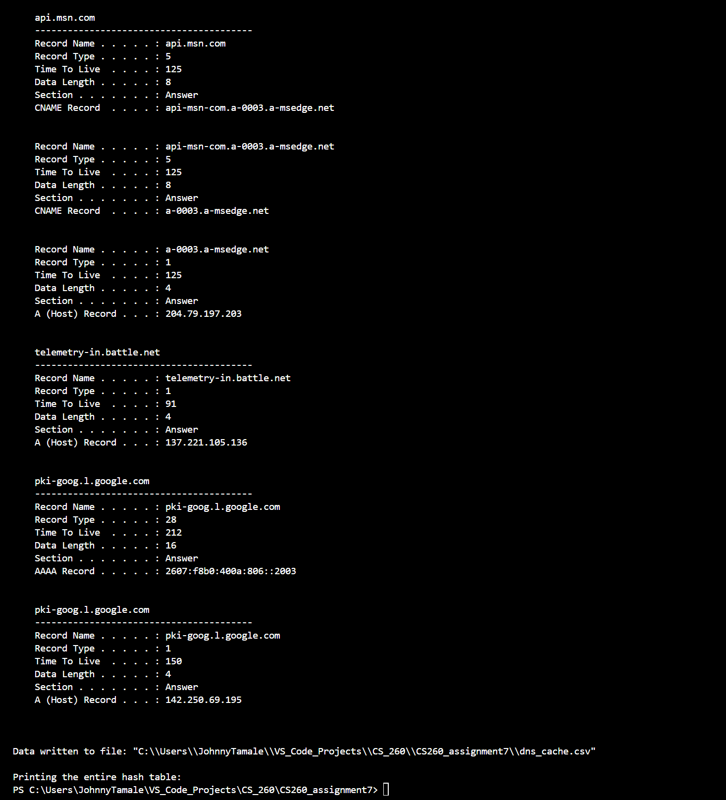

# CS260_assignment7
This first few commits were a modified version of the hashtable example from https://www.geeksforgeeks.org/implementation-of-hash-table-in-c-using-separate-chaining/. Instead of adding names to the hashtable, the program was modified to add real data from the local computer it is ran on. It should successfully take the DNS cache from a windows CMD using the ipconfig /displaydns and add it to the hash table for further manipulation. I really don't like working with mock data as it usually doesn't show the potential for what these concepts have. I tried to debug this as much as I could but I could not get the data from the dns to properly work with the hash table

